# Credit Rating System

Распределённая система для оценки кредитоспособности клиентов и обработки кредитных заявок с поддержкой REST, GraphQL, gRPC, асинхронной обработки через RabbitMQ и real-time уведомлений через WebSocket.

## Архитектура системы

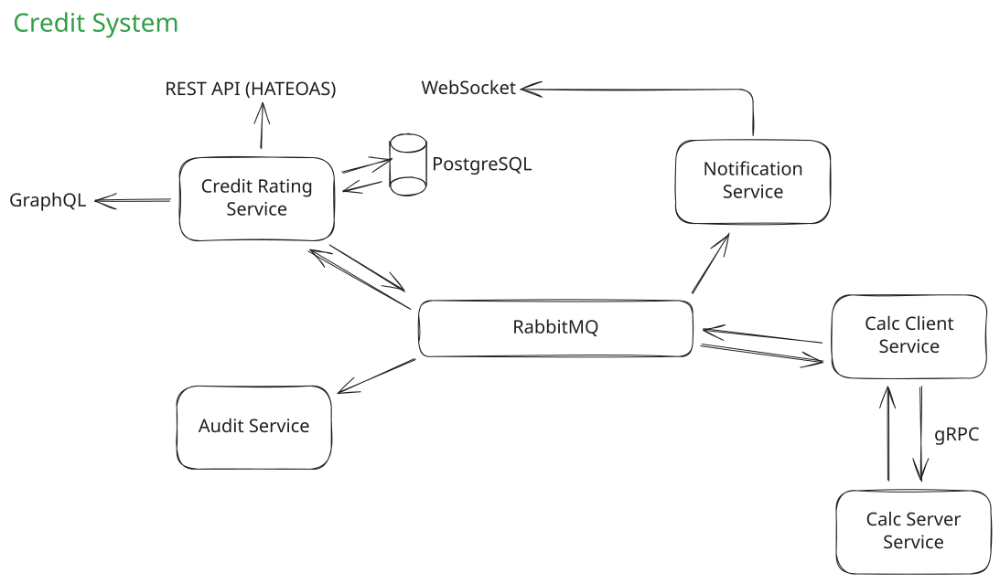

## Сервисы проекта

| Сервис                       | Описание                                                                          |
| ---------------------------- | --------------------------------------------------------------------------------- |
| **sop-app-contracts**        | Контракты REST API, GraphQL, события RabbitMQ, gRPC (.proto)                      |
| **sop-credit-rating**        | Главный сервис, предоставляющий REST (HATEOAS) и GraphQL API для пользователей.   |
| **sop-grpcclient-calc**       | Слушает события RabbitMQ и вызывает gRPC-server для расчётов.                     |
| **sop-grpcserver-calc**      | Сервис расчёта кредитоспособности и генерации оффера.                             |
| **sop-audit-service**        | Сервис аудита: собирает события (assessment, offer) в CSV и формирует статистику. |
| **sop-notification-service** | Отправляет клиентам уведомления о результатах оценки и генерации оффера.          |

## Порты сервисов

| Сервис                  | Порт  | Назначение          |
| ----------------------- | ----- | ------------------- |
| sop-credit-rating       | 8080  | REST/GraphQL API    |
| sop-audit-service       | 8081  | Actuator/Metrics    |
| sop-grpcclient-calc     | 8082  | Actuator/Metrics    |
| sop-grpcserver-calc     | 8083  | Actuator/Metrics    |
| sop-grpcserver-calc     | 9091  | gRPC                |
| sop-notification-service| 8084  | WebSocket/Actuator  |
| PostgreSQL              | 5432  | База данных         |
| RabbitMQ                | 5672, 15672 | AMQP, Web UI   |
| Zipkin                  | 9411  | Трассировка         |
| Prometheus              | 9090  | Метрики             |
| Grafana                 | 3000  | Дашборды            |

## Быстрый старт

### Требования

- Docker и Docker Compose
- Java 17+ и Maven (встроен в проекты через Maven Wrapper)

Скрипты доступны в `.sh` (Linux/macOS) и `.bat` (Windows) вариантах.

### Запуск системы

```bash
# Сборка всех сервисов и Docker-образов
./scripts/build.sh

# Остановка старых контейнеров и запуск всей системы через Docker Compose
./scripts/start.sh

# Остановка всех запущенных контейнеров   
./scripts/stop.sh

# Полная очистка (контейнеры, volumes, Maven артефакты)
./scripts/clean.sh
```


## Ссылки после запуска

- **REST API**: http://localhost:8080
- **Swagger UI**: http://localhost:8080/swagger-ui.html
- **GraphiQL**: http://localhost:8080/graphiql
- **WebSocket Demo**: http://localhost:8084
- **RabbitMQ Management**: http://localhost:15672 (guest/guest)
- **Zipkin**: http://localhost:9411
- **Prometheus**: http://localhost:9090
- **Grafana**: http://localhost:3000 (admin/admin)

## Демонстрация функционала

### REST API с HATEOAS

**Swagger UI - документация API клиентов**

<div align="center">
    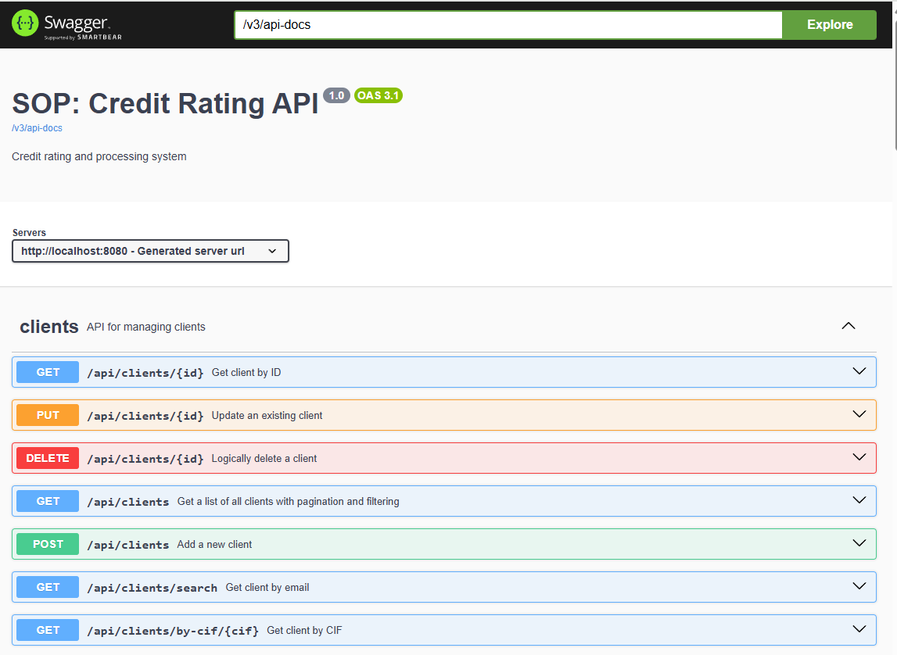
</div>

**Корневая точка входа REST API с гипермедиа**

<div align="center">
    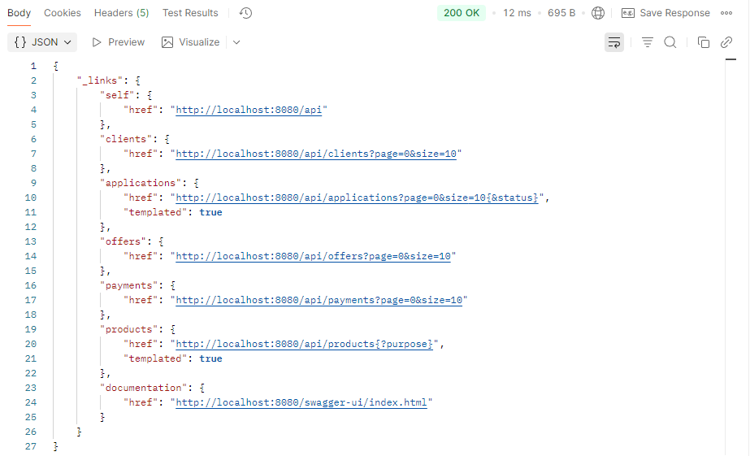
</div>

**Гипермедийные ссылки в Postman**

<div align="center">
    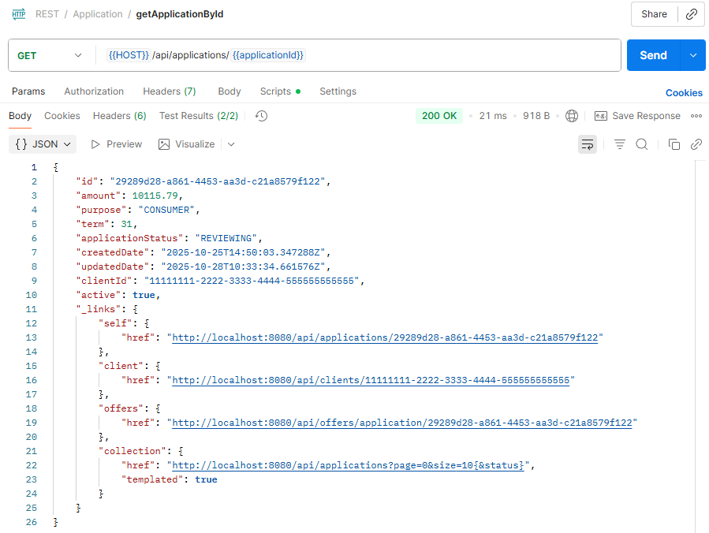
</div>

### GraphQL API

**Запрос данных клиента и его заявок**

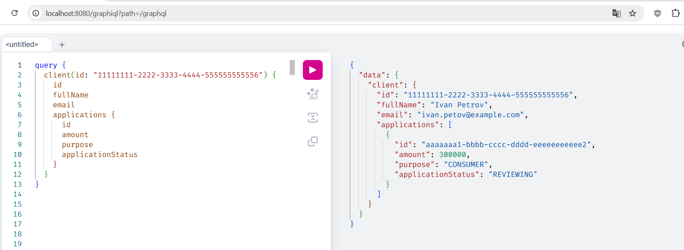

**Мутация: создание нового клиента**

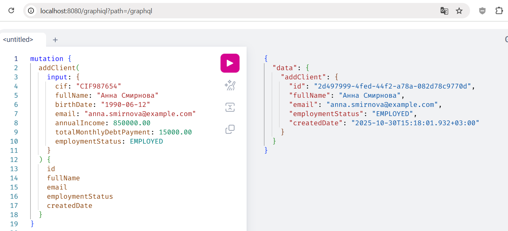

**Подписка на результаты оценки заявки**

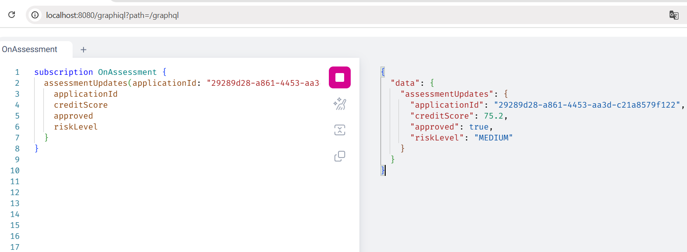

### Асинхронная обработка (RabbitMQ)

**Список очередей в RabbitMQ Management**

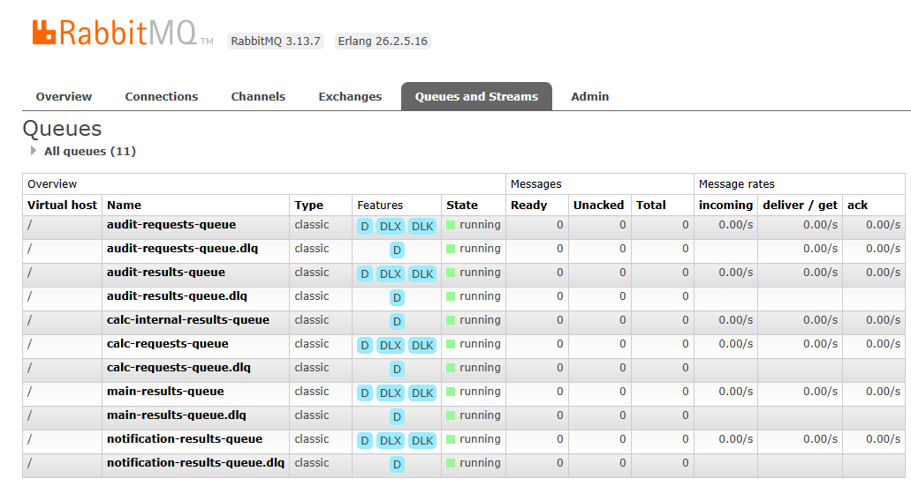

**Fanout и Topic Exchange с привязанными очередями**

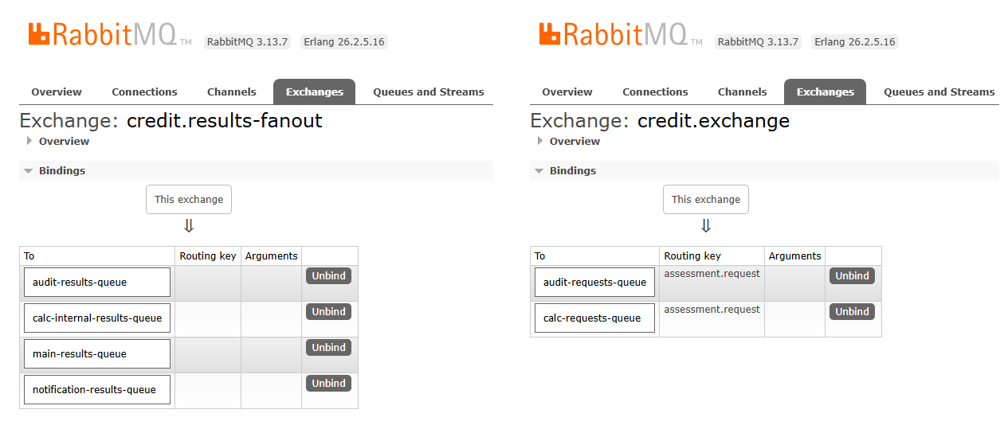

### Real-time уведомления (WebSocket)

**Интерфейс получения уведомлений**

<div align="center">
    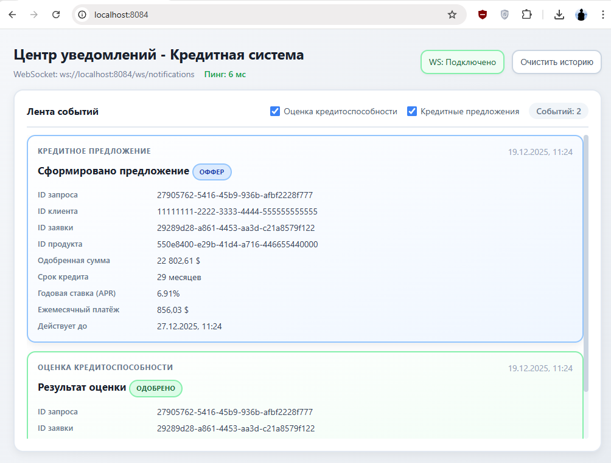
</div>

### Мониторинг и трассировка

**Дашборд Grafana**

<div align="center">
    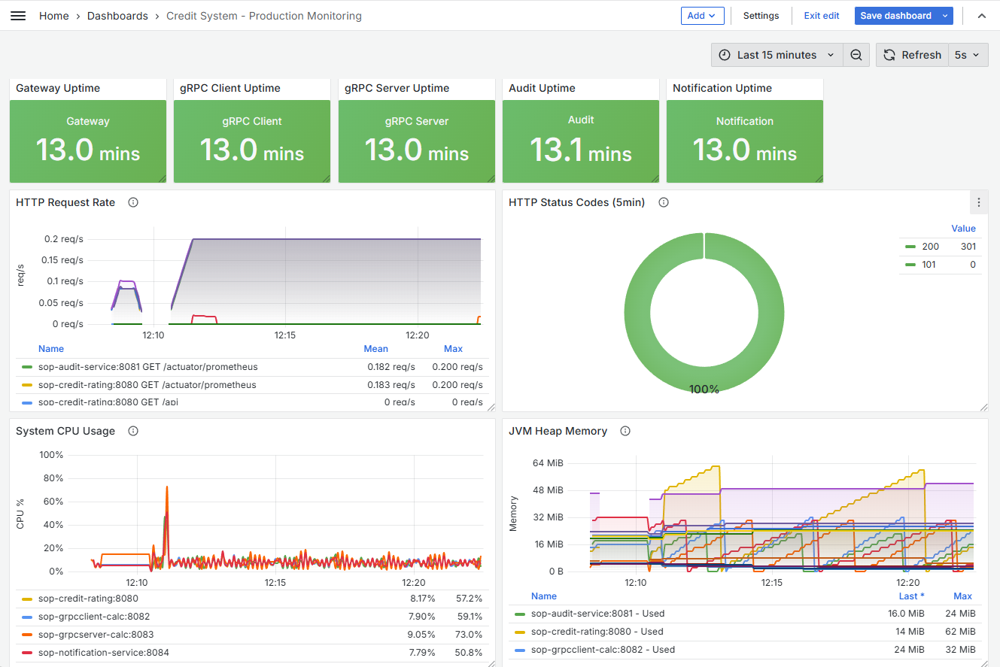
</div>

**Распределённая трассировка запроса в Zipkin**

<div align="center">
    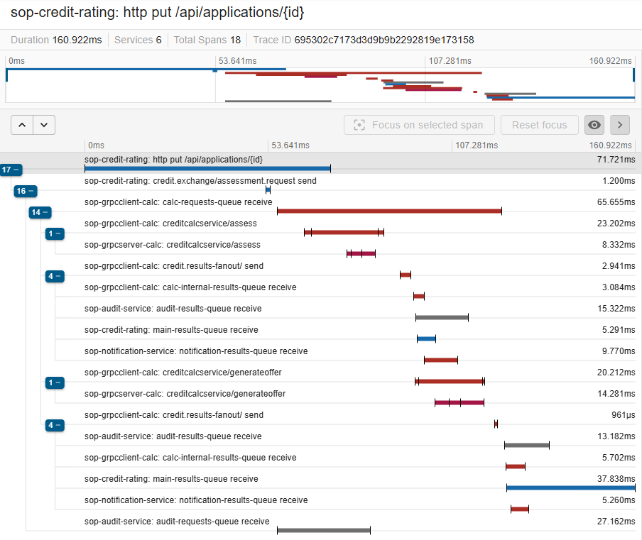
</div>
